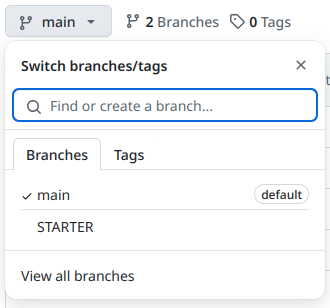
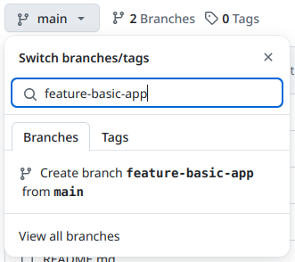
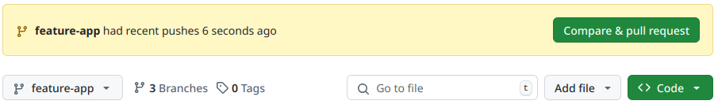
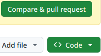
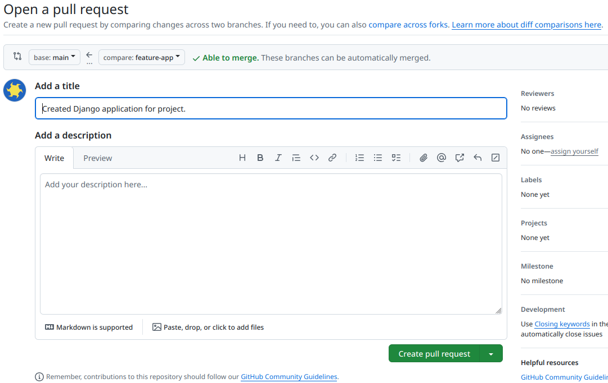
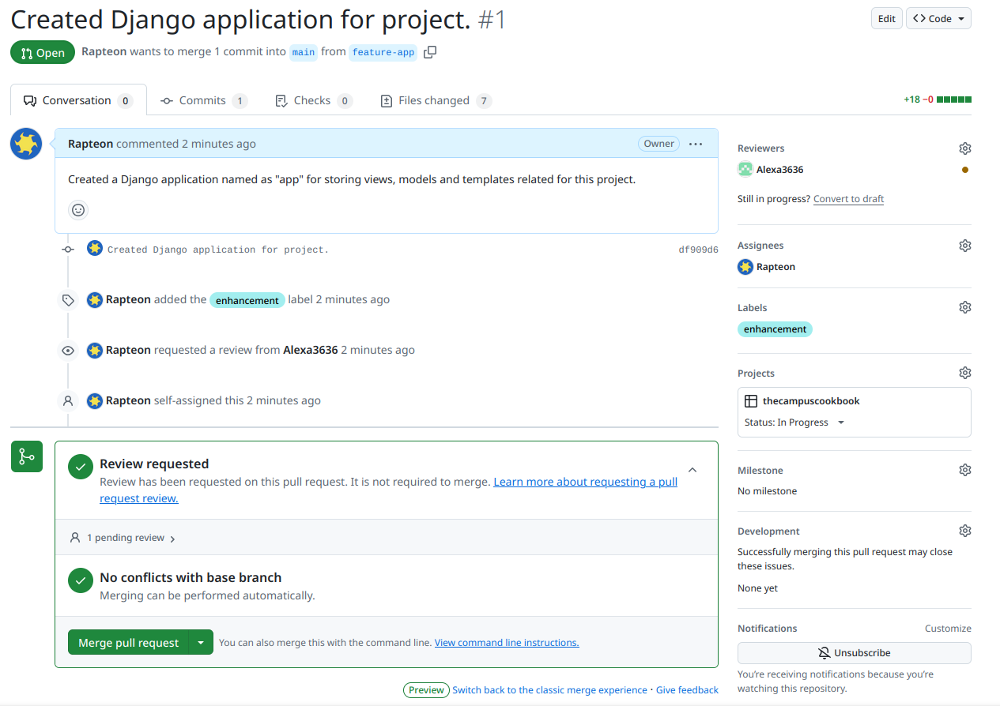

# The Campus Cookbook

A user-friendly online platform for viewing and posting recipes effortlessly.

## Setup for development

### Install the following software

1. VSCode
2. Anaconda or Miniconda. Ensure you can run the `conda` command through your terminal.
3. Git

### Setup conda environment

1. Navigate to the checked-out repository folder: `cd thecampuscookbook`
2. Run the command:  
   ```
   conda env create
   ```
   This will use the **environment.yml** file to create the development environment.
3. Activate the conda environment using the command:
   ```
   conda activate cookbook
   ```

### Other Conda options

#### Updating Conda environment

1. Create a new environment with the required dependencies:  
   ```
   conda create -n cookbook python==3.11 django pillow black pre-commit
   ```
2. Navigate to the checked-out repository and export the environment.:
   ```
   conda env export -n cookbook --ignore-channels --from-history -f environment.yml
   ```
3. Commit the **environment.yml** file to version control. Ensure that it does
not have platform-specific dependencies.

#### Removing a Conda environment

1. Deactivate the environment by running:
   ```
   conda deactivate
   ```
2. Remove the environment by running:
   ```
   conda env remove -n cookbook
   ```

### Using Git and GitHub

#### On a Macbook
1. Open a terminal.
2. Run the command  
    ```
    ssh-keygen -t ed25519
    ```
    This will ask you to provide a filepath to for storing the key.
    Please provide a valid path to the file and remember the path for future use.  
    The key generation utility will then ask you to set a password, but this is optional and can be skipped by just pressing the enter key.
3. Run the command:
    ```
    ssh-add <the_path_to_key_file>
    ```
    Replace `<the_path_to_key_file>` with the path you had used for storing the key.
4. Click on **Switch branches/tags** button on this page. Then type in a new
branch name.  
You will be using this branch to work on your code. See the image below:  
  
Then type in a branch name:  

5. If you have already cloned this repository before, navigate to the checked-out repository folder through the terminal and run:  
    ```
    git pull
    ```
6. If this is your first time cloning the repository, run the following in a
new terminal:  
    ```
    git clone git@github.com:Rapteon/thecampuscookbook.git
    ```
6. After ensuring that you have the repository on your computer, switch
to the branch which you created. Run the command:
    ```
    git checkout <the-branch-name>
    ```
    The branch name must match the name you used to create the branch on GitHub.
7. After ensuring that the conda environment for this project active, run the command  
    ```
    pre-commit install
    ```
    This will install a Git hook which would automatically format your Python
    code before each commit.  
    Note that you can also run this hook manually using the command `pre-commit run`  
    when the conda environment is active.
7. Start making your code changes. Once you have finished making your changes, proceed to the [section on committing your changes](#Committing-changes).

### Committing changes

Ensure that you have navigated to the repository folder in your terminal
window. This is essential for all the following commands.

You should run `git status` before/after each command to determine the status of your files.  
Running status command shows you which information
about modified and unstaged (files which are not marked for commit) files.

Committing changes is a four-stage process:
1. Add your files so that Git knows these files need to be version controlled.  
Run the command:  
    ```
    git add <file_or_folder_to_store>
    ```
2. Commit the files to Git by running:  
    ```
    git commit -m '<message string describing changes>'
    ```
    If you see a message asking you to configure your Git username and password, follow the instructions shown in the terminal.  
    Then repeat this step.
3. All commits are local by default, so you need to upload (a.k.a. push) your changes to GitHub so that other members  
of the team can view and integrate them in their code. To do so, run:  
    ```
    git push
    ```
4. Open the GitHub website, and select your branch through the **Switch branches/tags**  
button (shown in the image below).  
  
After selecting the branch, you'll see a banner like the following suggesting  
you to create a new pull request:  

5. Click on **Compare and pull request** button:  
  
This will take you to a new page.
6. Add a title for your pull request and describe your changes. See the image below:  
  
7. The following figure shows a pull request which can be easily merged (no conflicts).  
Do note that you need approval from at least 1 reviewer before the code can be merged into the main branch.


## Pre-commit hooks

This repository can be configured with a pre-commit hook to format Python files before committing them to Git.  
It is strongly recommended to install the pre-configured hook.

The pre-commit hook uses the [Black formatter](https://github.com/psf/black)
to format .py files.   

### Setup pre-commit hook for auto-formatting code.

1. Ensure the conda environent for the project is activated. Check the section for creating a Conda environment.
2. Run the command `pre-commit install` if activating your environment for the first time.
3. Autoformatting of Python code happens when you commit your code using `git commit`.  
In case the formatter decides the code is not formatted, you will see a *failed* message after  
trying to commit the changes. This means the file has been formatted, but your changes  
have not been committed. After the *failed* message, simply add the file using `git add <failed_file_path>`  
and then commit the changes again using `git commit -m '<message>'`.
4. If you would like to run the formatter manually, you can run it like `black <file_name>.py`.


## SQLite development database

### Setup the database

1. Activate the conda environment as specified in the [conda env setup section](#setup-conda-environment).
2. Navigate to the directory containing the `manage.py` file.
3. Run `python manage.py migrate` to create the database.

We have created a script to populate the database with sample data.  
To run the `data-populator.py` script, type `python data-populator.py`

### Making changes to the database

Making changes to any of the model.py files means you would need to update the database.  
Note that you might also need to modify the `data-populator.py` script to support  
new schema changes.
In this scenario, follow these steps:
1. Save the modified `models.py` file.
2. Delete the existing `db.sqlite3` file. This means you will be deleting the existing database.
3. Navigate to the directory containing the `manage.py` script.
4. Run `python manage.py makemigrations`. This will create one or more migration files in the modified app.
5. Run `python manage.py migrate`. This command will apply the changes to your database.
6. Run `python data-populator.py` script to repopulate the database.